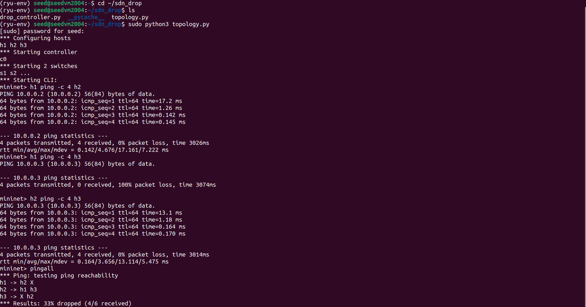
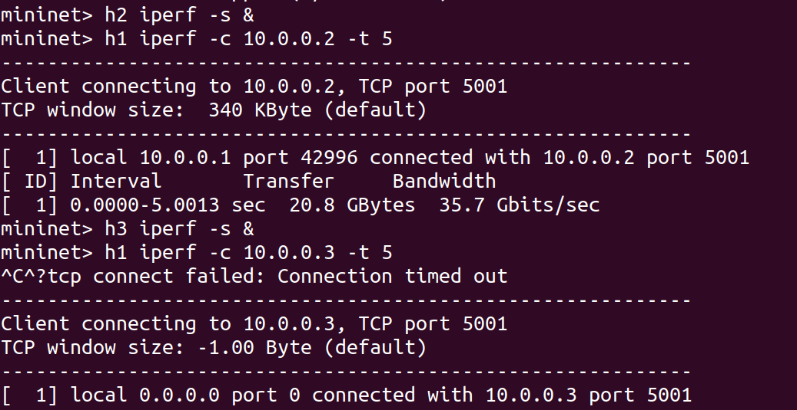
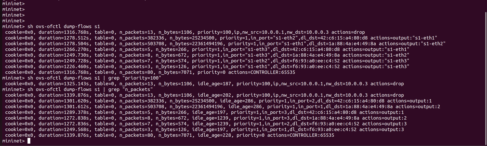
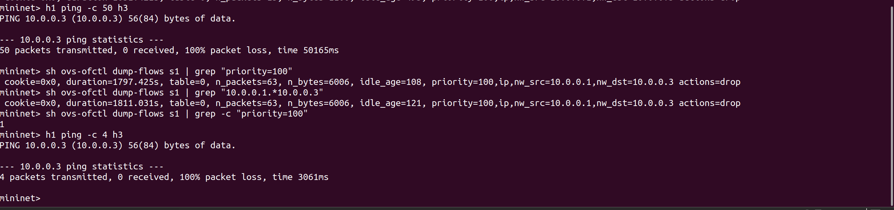
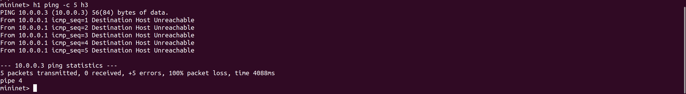
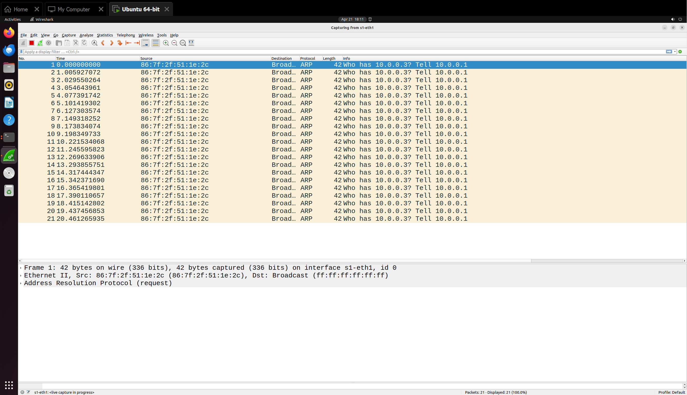
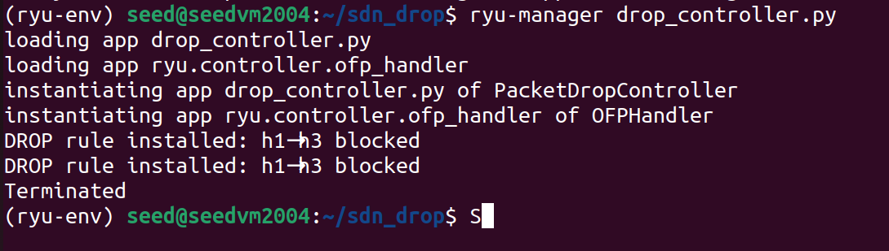

# SDN Packet Drop Simulator

> This project demonstrates a Software Defined Networking (SDN) application using a custom Ryu SDN Framework controller with a Mininet topology. The Ryu controller has a high priority dynamic system controller that discards packers within the DROP RULE and allows transmission of other packets without issue.

It implements:
* A linear topology is made for the 3 host devices which are h1, h2, h3 connected to each other in via switches s1 and s2.
* A dynamic custom flow rule to drop traffic from h1 → h3 and the path is blocked.
* All other data flowing from any other hosts is considered valid and will flow normally without any disturbance.
 
---
 
## Table of Contents
 
- [Problem Statement](#problem-statement)
- [Architecture](#architecture)
- [Prerequisites](#prerequisites)
- [Setup & Installation](#setup--installation)
- [Project Structure](#project-structure)
- [Running the Simulation](#running-the-simulation)
- [Test Scenarios](#test-scenarios)
- [Regression Test](#regression-test)
- [Proof of Execution](#proof-of-execution)
- [SDN Concepts Demonstrated](#sdn-concepts-demonstrated)
- [References](#references)
---
 
## Problem Statement
 
Design and implement an SDN-based **Packet Drop Simulator** using Mininet and an OpenFlow 1.3 controller (Ryu) that:
 
- Installs explicit **drop flow rules** on a specific traffic flow
- Demonstrates **controller–switch interaction** via OpenFlow packet_in events
- Measures and observes **packet loss** on the blocked path and normal throughput on the allowed path
- Verifies drop rules **persist correctly** under traffic load (regression test)
**Blocked flow:** `h1 (10.0.0.1) → h3 (10.0.0.3)` — 100% packet drop  
**Allowed flows:** `h1 ↔ h2`, `h2 ↔ h3`, `h3 → h1` — normal forwarding
 
---
 
## Architecture
 
```
        Ryu Controller (127.0.0.1:6633)
               |          |
          OpenFlow      OpenFlow
               |          |
    h1 ── s1 ──────── s2 ── h3
    h2 ──┘
    
    h1 = 10.0.0.1
    h2 = 10.0.0.2
    h3 = 10.0.0.3
```
 
**Flow rule priority table:**
 
| Priority | Match | Action | Purpose |
|----------|-------|--------|---------|
| 100 | IPv4, src=10.0.0.1, dst=10.0.0.3 | DROP (empty) | Block h1→h3 |
| 1 | in_port + eth_dst (learned) | Forward | Normal forwarding |
| 0 | (any) | Send to controller | Table-miss fallback |
 
---
 
## Prerequisites
 
- Ubuntu 20.04 / 22.04 (VM or native)
- Mininet already installed (`sudo mn` works)
- Python 3.9
- Sudo privileges
---
 
## Setup & Installation
 
### 1. Install Ryu controller
 
```bash
sudo apt install python3-pip python3-dev -y
pip3 install ryu --break-system-packages
 
# If you get eventlet errors:
pip3 install eventlet==0.30.2 --break-system-packages
 
# Verify
ryu-manager --version
```
 
### 2. Clone this repository
 
```bash
git clone https://github.com/<your-username>/sdn-packet-drop-simulator.git
cd sdn-packet-drop-simulator
```
 
### 3. Make scripts executable
 
```bash
chmod +x topology.py drop_controller.py
```
 
---
 
## Project Structure
 
```
sdn-packet-drop-simulator/
├── topology.py          # Mininet topology (3 hosts, 2 switches)
├── drop_controller.py   # Ryu OpenFlow controller with drop rules
├── README.md            # This file
└── results/
    ├── flow_table.txt   # Saved ovs-ofctl dump-flows output
    ├── ping_blocked.txt # Ping results — h1→h3 (blocked)
    └── ping_allowed.txt # Ping results — h1→h2 (allowed)
```
 
---
 
## Running the Simulation
 
> **Important:** Always run `sudo mn -c` between runs to clean up stale state.
 
### Terminal 1 — Start Ryu controller
 
```bash
ryu-manager drop_controller.py --verbose
```
 
Wait until you see output like:
```
connected socket:<eventlet.greenio...>
datapath id = 0x0000000000000001
[SWITCH 1] Connected. DROP rule installed: 10.0.0.1 --> 10.0.0.3 BLOCKED
```
 
### Terminal 2 — Start Mininet topology
 
```bash
sudo python3 topology.py
```
 
You should get a `mininet>` prompt.
 
### Cleanup (between runs)
 
```bash
sudo mn -c
```
 
---
 
## Test Scenarios
 
### Scenario 1 — Allowed vs Blocked (ping)
 
Tests the core drop rule. Run inside the `mininet>` CLI:
 
```bash
# ALLOWED — should succeed (0% packet loss)
h1 ping -c 4 h2
 
# BLOCKED — should fail (100% packet loss)
h1 ping -c 4 h3
 
# ALLOWED — h2→h3 has no drop rule
h2 ping -c 4 h3
 
# Full mesh test
pingall
```
 
**Expected output:**
 
| Path | Expected Result |
|------|----------------|
| h1 → h2 | 0% packet loss |
| h1 → h3 | **100% packet loss** |
| h2 → h3 | 0% packet loss |
| h3 → h1 | 0% packet loss |
 
---
 
#### Screenshot — Scenario 1: Testing Connectivity to all hosts
 
<!-- Add screenshot here: shows h1→h3 blocked in pingall matrix -->


 
---
 
### Scenario 2 — Normal vs Failure (iperf throughput)
 
```bash
# NORMAL: h1 → h2 (allowed path)
h2 iperf -s &
h1 iperf -c 10.0.0.2 -t 5
 
# FAILURE: h1 → h3 (blocked path — TCP SYN dropped)
h3 iperf -s &
h1 iperf -c 10.0.0.3 -t 5
```
 
**Expected output:**
 
| Path | iperf Result |
|------|-------------|
| h1 → h2 | ~10 Gbits/sec throughput |
| h1 → h3 | "connect failed" — 0 bytes transferred |
 
---
 
#### Screenshot — Scenario 2: iperf results (Checking the Throughput)
 
<!-- Add screenshot here: iperf showing throughput on h1→h2 and failure on h1→h3 -->



 
---
 
### Viewing Flow Tables
 
```bash
# Full flow table (run inside mininet> CLI)
sh ovs-ofctl dump-flows s1
 
# Show only the drop rule
sh ovs-ofctl dump-flows s1 | grep "priority=100"
 
# Show packet counters (n_packets increments on each blocked ping)
sh ovs-ofctl dump-flows s1 | grep "n_packets"
```
 
---
 
#### Screenshot — Flow table with drop rule
 
<!-- Add screenshot here: ovs-ofctl dump-flows showing priority=100 drop rule with n_packets counter -->



 
---
 
## Regression Test
 
Verifies that the drop rule **persists correctly** after heavy traffic and is not overridden or removed.
 
```bash
# Step 1 — Baseline: confirm rule exists before traffic
sh ovs-ofctl dump-flows s1 | grep "priority=100"
 
# Step 2 — Stress: send 50 pings on blocked path
h1 ping -c 50 h3
 
# Step 3 — Post-test: rule must still be present
sh ovs-ofctl dump-flows s1 | grep "priority=100"
 
# Step 4 — n_packets must be >= 50
sh ovs-ofctl dump-flows s1 | grep "10.0.0.1.*10.0.0.3"
 
# Step 5 — Exactly 1 drop rule must exist (not duplicated)
sh ovs-ofctl dump-flows s1 | grep -c "priority=100"
 
# Step 6 — Blocked path still blocked after stress
h1 ping -c 4 h3
```
 
**Pass criteria:**
 
| Check | Expected |
|-------|----------|
| Drop rule still present | Yes — same rule entry |
| `n_packets` value | ≥ 50 |
| Number of drop rules | Exactly 1 |
| Blocked path after stress | 100% packet loss |
 
---
 
#### Screenshot — Regression: Flow table after stress
 
<!-- Add screenshot here: dump-flows after 50 pings showing n_packets >= 50 and rule still present -->


 
---
 
## Proof of Execution
 
### Wireshark / tcpdump capture
 
```bash
# Open xterm on h1 (inside mininet CLI)
xterm h1
 
# In h1's terminal — capture ICMP
tcpdump -i h1-eth0 icmp -n -v
```
 
Then ping the blocked path from the main CLI:
 
```bash
h1 ping -c 5 h3
```
 
**What you see:** ICMP echo requests leaving h1 with **no replies** from 10.0.0.3.
 
**Wireshark filter for blocked traffic:**
```
ip.src == 10.0.0.1 && ip.dst == 10.0.0.3
```
 
**Wireshark filter for comparison (allowed traffic):**
```
ip.src == 10.0.0.1 && ip.dst == 10.0.0.2
```
 
---
 
#### Screenshot — Wireshark: blocked traffic (no replies)
 
<!-- Add screenshot here: Wireshark showing ICMP requests from 10.0.0.1 to 10.0.0.3 with no echo-reply -->


 
---
 
#### Screenshot — Wireshark: allowed traffic (request + reply)
 
<!-- Add screenshot here: Wireshark showing h1→h2 ICMP with both request and reply visible -->


 
---
 
#### Screenshot — Ryu controller logs
 
<!-- Add screenshot here: Ryu terminal showing "DROP rule installed" and switch connection logs -->



 
---
 
## SDN Concepts Demonstrated
 
| Concept | How it's shown in this project |
|---------|-------------------------------|
| Controller–switch interaction | Ryu connects to OVS switches via OpenFlow 1.3 on port 6633; switch features event triggers rule installation |
| Flow rule design (match–action) | Three rule tiers: table-miss (priority 0), drop (priority 100, empty actions), forward (priority 1) |
| packet_in handling | `@set_ev_cls(EventOFPPacketIn)` implements MAC learning and installs forward rules dynamically |
| Network behaviour observation | Ping shows 100% loss on blocked path; iperf shows 0 throughput; flow table shows n_packets incrementing |
| Regression/validation | Drop rule persists after 50+ packets; exactly 1 rule entry confirmed; blocked path remains blocked |
 
---
 
## References
 
1. Mininet overview — https://mininet.org/overview/
2. Mininet walkthrough — https://mininet.org/walkthrough/
3. Ryu SDN framework documentation — https://ryu.readthedocs.io/en/latest/
4. OpenFlow 1.3 specification — https://opennetworking.org/wp-content/uploads/2014/10/openflow-spec-v1.3.0.pdf
5. Open vSwitch documentation — https://docs.openvswitch.org/en/latest/
6. Ryu application API — https://ryu.readthedocs.io/en/latest/ryu_app_api.html
7. Mininet GitHub repository — https://github.com/mininet/mininet
8. Ryu GitHub repository — https://github.com/faucetsdn/ryu
---
 
*Submitted for UE24CS252B — Computer Networks, PES University*
